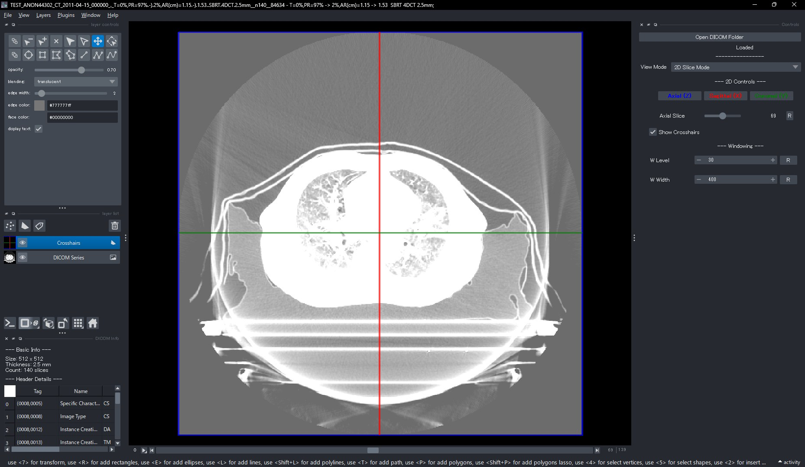
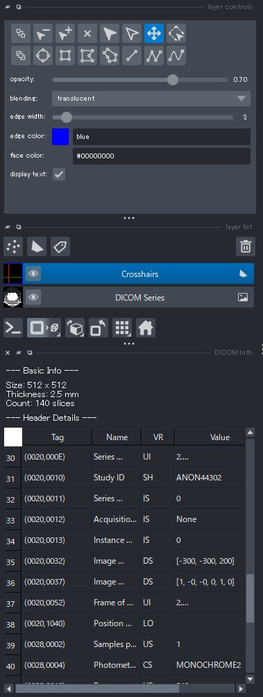
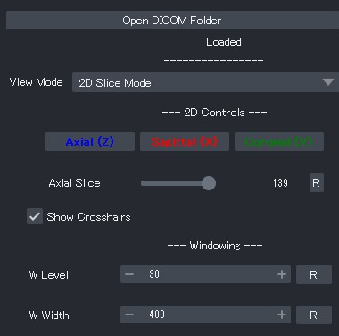
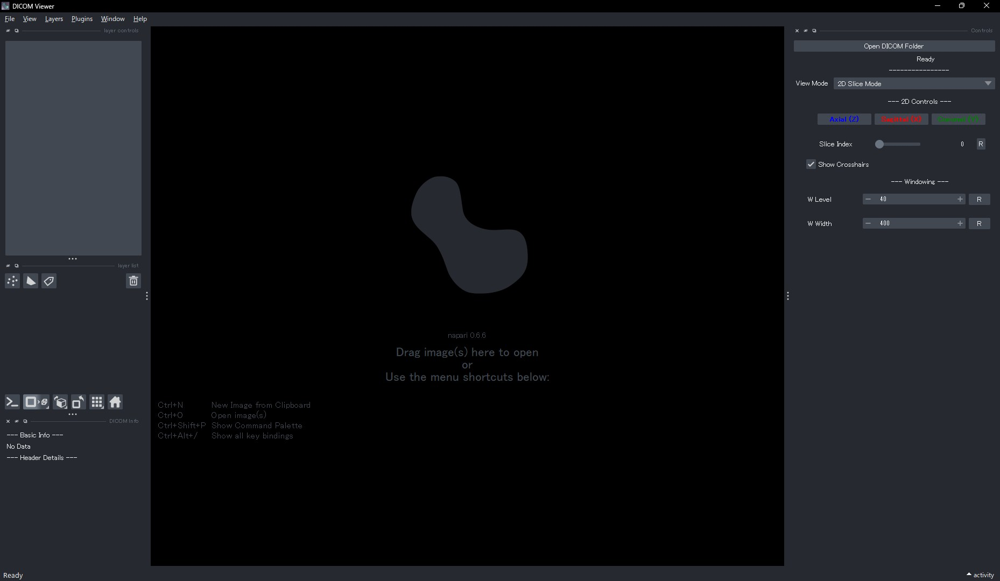
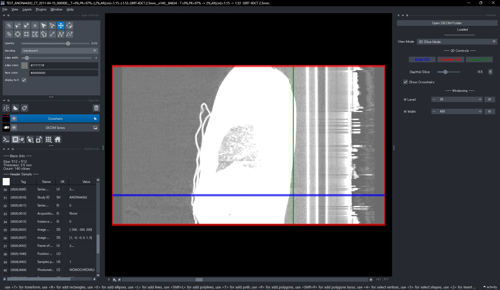
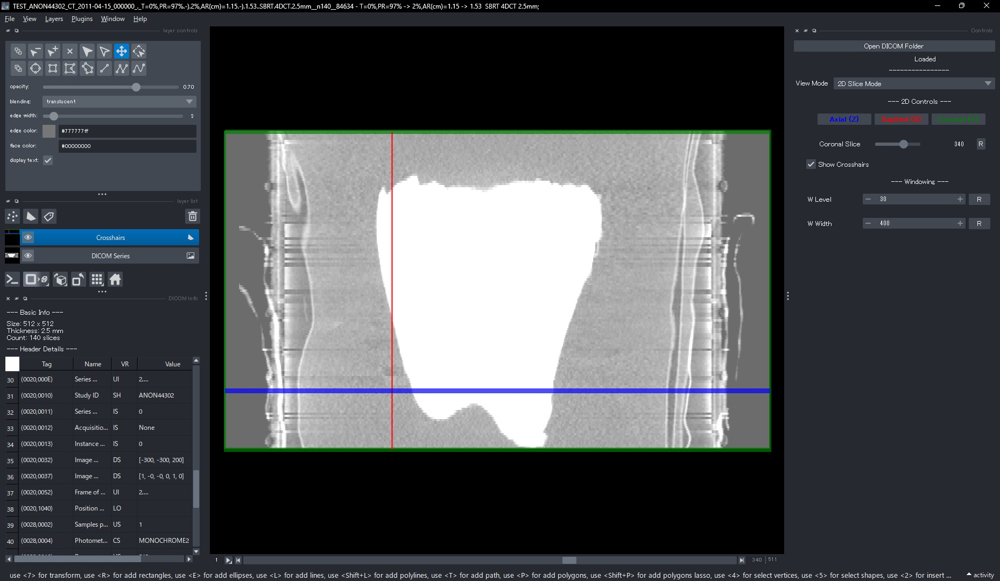
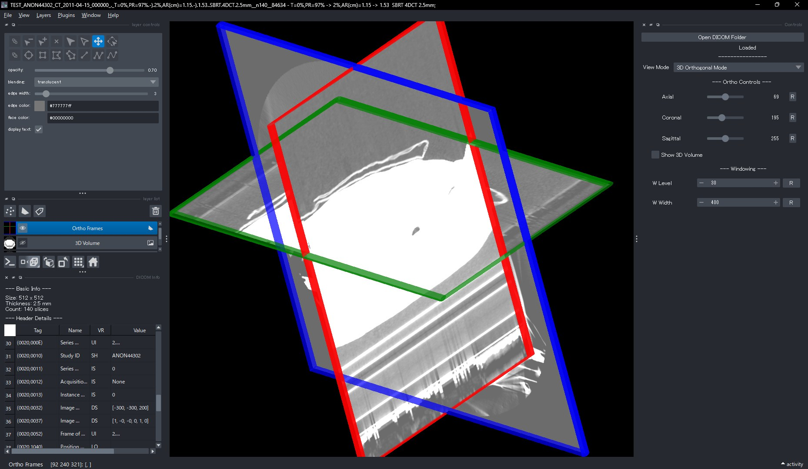
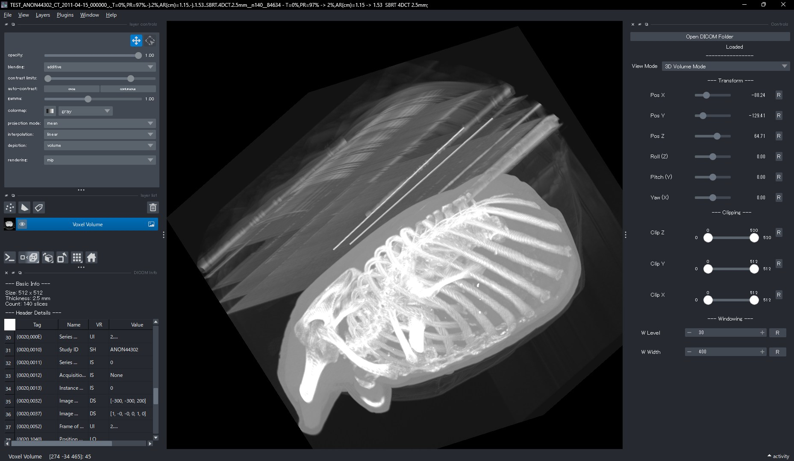
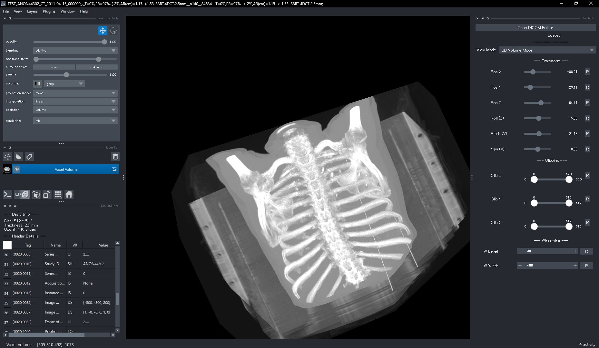

# DICOM Viewer 操作マニュアル

## 1. はじめに

本アプリケーションは、DICOM形式の医療画像系列（CTやMRIなど）を読み込み、閲覧するためのビューアソフトウェアです。通常の2次元スライス表示に加え、3次元空間上での直交断面表示（MPR）、およびボクセルデータを用いたボリュームレンダリング表示に対応しています。

## 2. 起動とデータの読み込み

### アプリケーションの起動

プログラム（MedViewer.exe）を実行してアプリケーションを起動してください。起動直後の画面では、画像データはまだ読み込まれておらず、ビューアは空の状態です。

### 画像データの読み込み

画面右側のコントロールパネル最上部にある「Open DICOM Folder」ボタンをクリックしてください。フォルダ選択ダイアログが表示されますので、閲覧したいDICOMファイル群（.dcm）が格納されているフォルダを選択します。

読み込みが完了すると、ウィンドウのタイトルバーが「[フォルダ名] - [系列名(Series Description)]」の形式に変更され、初期画面が表示されます。

## 3. 画面の構成

本アプリケーションの画面は、中央の画像表示エリアと、左右の操作パネル（サイドバー）で構成されています。これらのパネルはドラッグして位置を移動したり、畳んだりすることが可能です。

### 左サイドバー：DICOM Info（情報パネル）

左上からBasic Infoまでは、napari標準の情報パネルです。詳しくは[napari公式ドキュメント](https://napari.org/stable/)を読んでください。

その下のセクションからは、読み込んだ画像に関する情報が表示されます。

* **Basic Info**: 画像の基本的なスペックを表示します。
* Size: 画像の解像度（横ピクセル数 × 縦ピクセル数）
* Thickness: スライスの厚み（mm）
* Count: 画像系列の総スライス枚数

* **Header Details**: DICOMヘッダに含まれる詳細なタグ情報を一覧表形式で表示します。

### 右サイドバー：Controls（操作パネル）

画像の表示モード切り替えや、具体的な操作を行うメインパネルです。

* **View Mode**: 表示モードを「2D Slice Mode」「3D Orthogonal Mode」「3D Volume Mode」の3つから切り替えます。
* **モード別操作エリア**: 選択したモードに応じたボタンやスライダが表示されます（詳細は後述）。
* **Windowing**: 画像のコントラスト調整を行います（詳細は後述）。

## 4. 画質の調整（Windowing）

右サイドバー下部の「Windowing」セクションでは、画像の明るさとコントラストを調整できます。この設定はすべての表示モードに適用されます。

* **W Level (Window Level)**
表示する輝度の中心値を設定します。数値を上げると画像全体が暗くなり、下げると明るくなります。CT値などで特定臓器を見やすくするために調整します。
* **W Width (Window Width)**
表示する輝度の幅（レンジ）を設定します。数値を大きくする（幅を広げる）と、白黒の差が緩やかになり、多くの濃淡情報が表示されます（コントラスト低下）。数値を小さくする（幅を狭める）と、白黒がはっきりとした表示になります（コントラスト強調）。
* **リセット機能**
各数値入力欄の右側にある「R」ボタンをクリックすると、DICOMヘッダに記録されている推奨値（初期値）に戻ります。

## 5. 各表示モードの詳細操作

右サイドバーの「View Mode」メニューからモードを選択することで、以下の機能を切り替えられます。

### 5.1 2D Slice Mode（2Dスライスモード）

画像を1枚ずつの断面として表示する、最も基本的なモードです。

標準的なnapariの機能として、ズームイン・ズームアウト、移動なども利用可能です。これらの操作は、マウスホイールやドラッグ操作で行えます。

* **断面切り替えボタン**
表示する断面の向きを切り替えます。ボタンの文字色は、画面上のガイド線（クロスヘア）の色と対応しています。
* **Axial (Z)**: 体の軸に対して垂直な断面（青色）。
* **Coronal (Y)**: 体を前後に分ける断面（緑色）。
* **Sagittal (X)**: 体を左右に分ける断面（赤色）。

* **Slice Index（スライス移動）**
スライダを左右に動かすことで、表示するページ（スライス位置）を移動できます。スライダ右側の「R」ボタンを押すと、画像の中央位置に戻ります。
* **Show Crosshairs（クロスヘア表示）**
チェックボックスのオン／オフで、画面上の十字線の表示を切り替えます。この十字線は、現在表示されていない「他の2つの断面」がどの位置にあるかを示しています。

なおこのモードでは、画面下にあるスライダも使うことができます。 これは「全スライスを連続的に自動再生する」ためのもので、スライダを右に動かすと再生が始まり、左に動かすと停止します。

### 5.2 3D Orthogonal Mode（3D直交断面モード）

3次元空間の中に、Axial・Coronal・Sagittalの3つの断面を十字に交差させて表示するモードです。空間的な位置関係を把握するのに適しています。

標準的なnapariの機能として、ズームイン・ズームアウト、回転なども利用可能です。これらの操作は、マウスホイールやドラッグ操作で行えます。

* **スライス位置の調整**
* **Axial Slice**: 青色の枠で囲まれた断面を上下に動かします。
* **Coronal Slice**: 緑色の枠で囲まれた断面を前後に動かします。
* **Sagittal Slice**: 赤色の枠で囲まれた断面を左右に動かします。
各スライダ右側の「R」ボタンを押すと、初期位置（中央）に戻ります。

* **Show 3D Volume**
チェックを入れると、3つの断面に加え、半透明のボリュームレンダリング像を重ねて表示します。全体像の中で断面がどこにあるかを確認できます。

### 5.3 3D Volume Mode（3Dボリュームモード）

ボクセルデータを直接計算し、骨や血管などの立体構造を表示するモードです（MIP法によるレンダリング）。

標準的なnapariの機能として、ズームイン・ズームアウト、回転なども利用可能です。これらの操作は、マウスホイールやドラッグ操作で行えます。

* **Transform（位置と回転）**
表示されている3Dモデルの位置や角度を変更します。
* **Pos X / Y / Z**: 3Dモデルを空間内で平行移動させます。
* **Roll (Z) / Pitch (Y) / Yaw (X)**: 3Dモデル自体を回転させます。
* **Reset Transform**: 「Reset Transform」ボタンを押すと、移動や回転がすべてリセットされ、初期状態に戻ります。

* **Clipping（断面カット）**
3Dモデルの一部を切り取って、内部を観察するための機能です。
* **Clip Axial (Z)**: 上下の範囲を制限します。
* **Clip Coronal (Y)**: 前後の範囲を制限します。
* **Clip Sagittal (X)**: 左右の範囲を制限します。
これらのスライダは「つまみ」が2つあるレンジスライダです。範囲を狭めることで、その範囲外のデータを非表示にします。各スライダ右側の「R」ボタンを押すと、クリッピングが解除され全体が表示されます。

特に、**断面カットの上限値を変更して、標準より大きくする**ことで、それまでよりも大きな範囲のデータを表示することができます。

